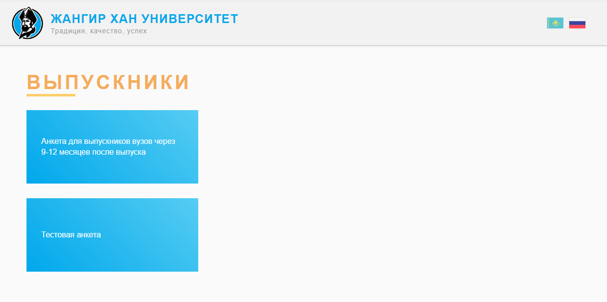
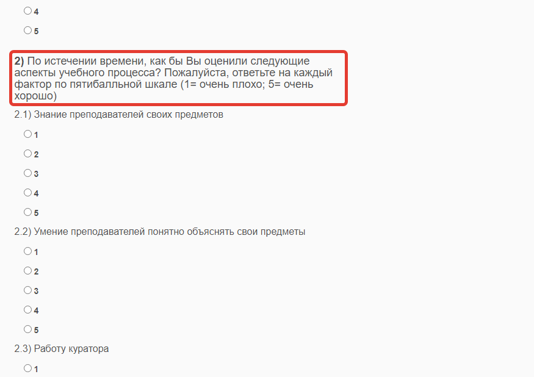
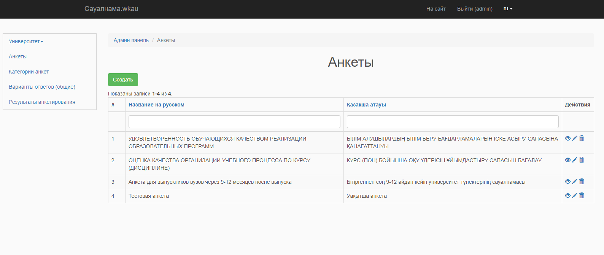
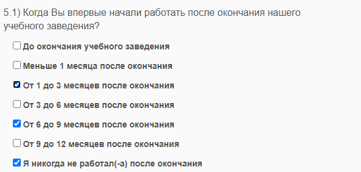
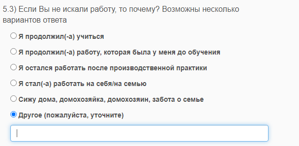
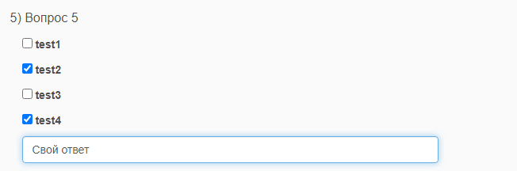
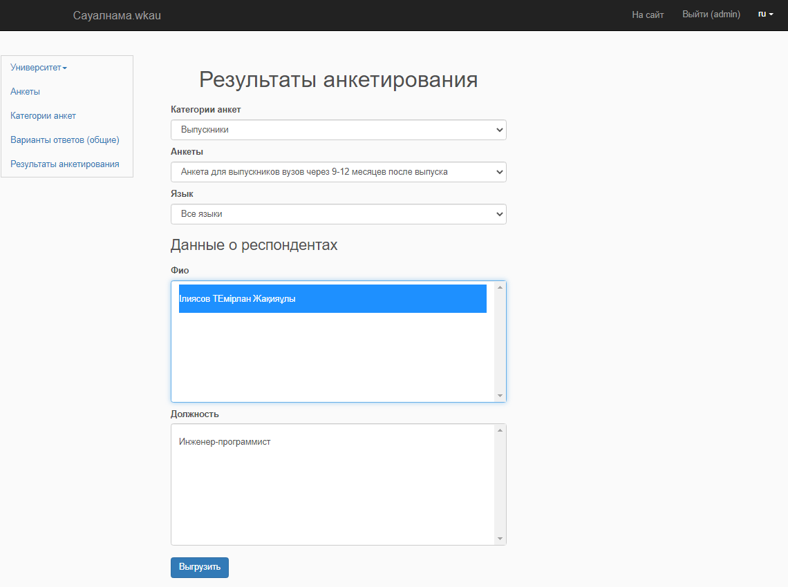

# Система анкетирования wkau.kz

Рзаработано веб-приложение предназначенное для анкетирования студентов, выпускников, сотрудников Западно-Казахстанкого аграрно-технического университета а также работодателей.

## Анкеты

Анкеты сгруппированы по категориям

## В приложении предусмотрен админ-панель.

###Функционал админки:

####- управление формированиями (институты(факультеты), высшие школы(кафедры), преподаватели)
####- добавление и редактирование анкет, категории анкет, вопросов к анкетам, вариантов ответов к вопросам

Вопросы делятся на два типа: 
1) вопросы о респонденте (вопросы в шапке) по которым в дальнейшем можно отсортировать результаты. 
2) вопросы самой анкеты
Вопросы самой анкеты можно группировать по категориям.

Варианты ответов к вопросам можно добавлять нескольких типов: 
1) множественный выбор (checbox)

2) выбор только одного варианта (radio input)

3) свой вариант респондента (input)

4) значение в процентах (hidden input + крутилка + js)

####- получение результатов в виде excel-таблицы
Есть возможность отфильтровать результаты по вопросам шапки и по языку анкетирования
